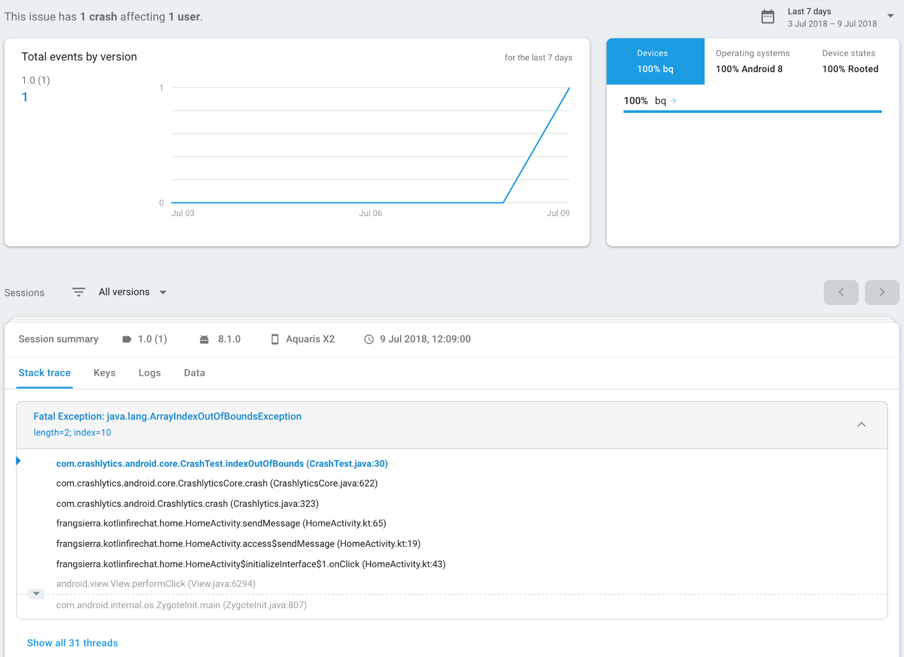

# Etape 1 
Pour commencer à configurer Firebase Crashlytics dans notre application, il vous suffit d’aller dans l’onglet Crashlytics de notre console Firebase et de cliquer sur Configurer Crashlytics.

Maintenant que nous avons activé Crashlytics dans la console Firebase, nous devons installer le SDK dans notre projet. Nous devons d’abord inclure les prochaines lignes dans notre fichier build.gradle au niveau du projet:
```sh
buildscript {
    repositories {
        // ...
        maven {
           url 'https://maven.fabric.io/public'
        }
    }
    dependencies {
        // ...
        //Crashlytics requires Google Services plugin version 3.1.2 or higher
        classpath 'io.fabric.tools:gradle:1.25.4'
    }
}

allprojects {
    // ...
    repositories {
       // ...
       maven {
           google()
       }
    }
}
```
# Etape 2
Ajoutez dans build.gradle niveau app La prochaine étape devrait être d’ajouter les dépendances suivantes dans notre fichier build.gradle au niveau de l’application:
```sh
 apply plugin: 'io.fabric'

dependencies {
    // ...
    implementation 'com.crashlytics.sdk.android:crashlytics:2.9.4'
}

```
# Etape 3

Avec cette configuration de base, Crashlytics commencera automatiquement à écouter et à collecter des rapports de plantage.

Vous pouvez tester votre implémentation à l'aide de Crashlytics.getInstance (). Crash () pour provoquer un blocage de votre application. Le crash apparaîtra dans votre console Firebase comme ceci:




# Remarque
Dans certains cas, nous voudrons activer / désactiver Crashlytics. Selon la politique de confidentialité de notre application, nous devrions désactiver Crashlytics pour les utilisateurs qui n'acceptent pas nos conditions générales et ne souhaitent pas partager leurs informations avec nous.

Pour ce faire, nous devrons désactiver l'initialisation automatique de Crashlytics en ajoutant la ligne suivante à notre manifeste:

```sh
<meta-data android:name="firebase_crashlytics_collection_enabled" android:value="false" />
 ```  

La prochaine étape consistera à activer Firebase Crashlytics à la demande dans notre instance d’application:

```sh
 if (prefs.termsAndConditionsAccepted) {
            val fabric = Fabric.Builder(this)
                    .kits(Crashlytics())
                    .debuggable(BuildConfig.DEBUG) // Enables Crashlytics debugger
                    .build()
            Fabric.with(fabric)
        }
        
 ```  

# Personnalisation des rapports Crashlytics

Crashlytics commence automatiquement à collecter les rapports d'incident dès que nous l'ajoutons à l'application. Toutefois, nous pouvons personnaliser notre configuration en ajoutant des rapports d’inscription, des journaux, des clés et même le suivi des erreurs non fatales. Voyons les différentes possibilités.

1.Poursuite des non-fatal errors

```sh
   Crashlytics.logException(error). 
```

2.Identificatiosn des utilisateurs

```sh
Crashlytics.setUSerIdentifier(String identifier)
```

3.Ajout de clés et de journaux personnalisés

Nous pouvons inclure des clés personnalisées pour nos accidents. Les clés personnalisées nous aident à connaître l'état spécifique de votre application, ce qui conduit à un blocage. Il existe cinq méthodes pour ajouter des clés personnalisées à nos événements, une pour chaque type de données:

```sh
Crashlytics.setString(String key, String value)

Crashlytics.setBool(String key, Boolean value)

Crashlytics.setDouble(String key, Double value)

Crashlytics.setFloat(String key, Float value)

Crashlytics.setInt(String key, Int value)

```
Avec les clés personnalisées. Nous pouvons inclure des journaux personnalisés dans nos crashs, ce qui nous permet d'ajouter plus de contexte aux événements menant à un crash. Crashlytics associe les journaux personnalisés à nos données d'incident et les rend visibles dans la console Firebase.

```sh
//Crash report and Log.println:
Crashlytics.log(Int priority, String tag, String msg);
//Crash report only:
Crashlytics.log(String msg);
```
